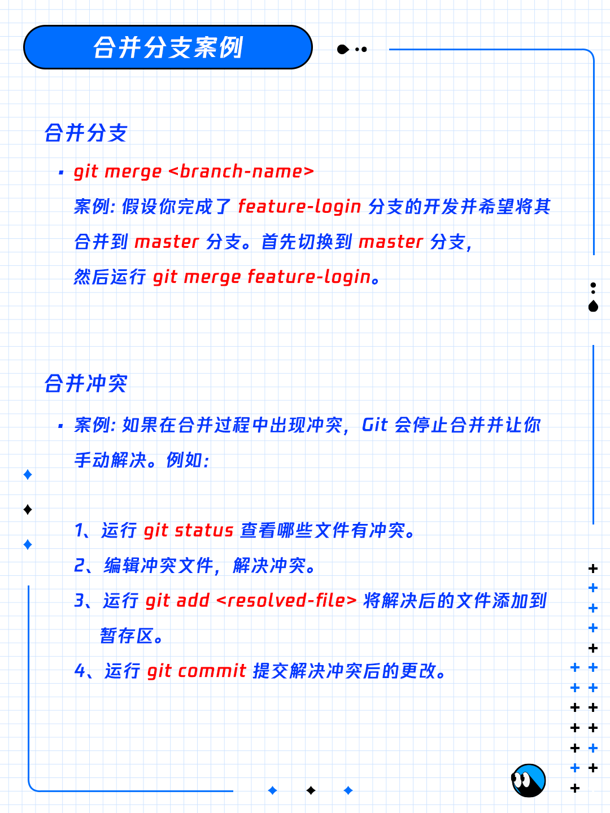

# git 基本操作 日常规范

#### 1. 常用命令

**初始化仓库**  **`git init.`**
案例:假设你开始一个新项目，首先在项目目录下打开终端运行 **git init** 来初始化一个新的 `Git` 仓库。

**查看状态** **`git status`**
案例: 运行 **git status** 可以查看当前目录下哪些文件被修改了哪些文件已经添加到暂存区，哪些文件还没有跟踪。

**添加文件**   **`git add`** <**file**>
案例: 你修改了 `READmE.md` 文件
然后运行 `git add READmE.md` 将更改添加到暂存区。
**git add .** 
案例:如果你修改了多个文件，可以使用 `git add .`将所有修改过的文件添加到暂存区。
**提交更改**    `git commit -m "commit message"`
案例: 暂存区准备好后，运行 `git commit -m "Initial commit"`来提交更改，其中 “`Initial commit`”是提交信息。





 ### 配置全局账户
设置提交代码时的用户信息。

```git
#输入你的用户名、密码，这时候已经系统已经将你的用户名密码全局保存，以后就不必再输入了
git config --global user.name  
git config --global user.email 

git config --global credential.helper store
git config --global user.email "你的邮箱"
git config --global user.name "你的github用户名"
git push
```

```git
#分支A_bracn和B_branch，只想将A_branch分支的某个文件f.txt合并到B_branch分支上。
git checkout A_branch
git checkout --patch v_clvchen /OcrSDKKit/Src/MVVM/View/CardMaskView2.m
```

```git
#创建一个空的Git存储库或重新初始化一个已有的存储库。
git init
#添加指定文件到暂存区。
git add [file1] [file2] ...
#添加指定目录到暂存区，包含子目录。
git add [dir]
#递归地添加当前工作目录中的所有文件。
git add .
```


```git
#删除
#删除工作区文件，并且将这次删除放入暂存区。
git rm [file1] [file2] ...
#停止追踪指定文件，但该文件会保留在工作区。
git rm --cached [file]
git checkout . #本地所有修改的。没有的提交的，都返回到原来的状态

#提交
#提交暂存区到仓库区。
git commit -m [message]
#提交暂存区的指定文件到仓库区。
git commit [file1] [file2] ... -m [message]

#分支
#列出所有本地分支。
git branch
#列出所有远程分支。
git branch -r
#新建一个分支，但依然停留在当前分支。
git branch [branchname]
git checkout -b [branch]
#删除远程分支 
git branch -r -d origin/branch-name  
git push origin :branch-name
#git推送本地分支到远程分支
#推送本地的feature-branch(冒号前面的)分支到远程origin的feature-branch(冒号后面的)分支(没有会自动创建
git push origin feature-branch:feature-branch  )
```

**合并** 合并指定分支到当前分支
git merge [branch]

**拉取** 从远程仓库中获取并尝试合并到当前分支中。
git pull [remote] [branch]

**推送** 上传本地指定分支到远程仓库。
git push [remote] [branch]

强行推送当前分支到远程仓库，即使有冲突。
git push [remote] --force

推送所有分支到远程仓库。
git push [remote] --all
git push <远程主机名> <本地分支名>:<远程分支名>

默认参数 -soft,所有commit的修改都会退回到git缓冲区
参数--hard，所有commit的修改直接丢弃
git reset --hard HEAD^        回退到上个版本
git reset --hard commit_id    退到/进到 指定commit_id

用git reflog打印你记录你的每一次操作记录

git diff：是查看 `workspace` 与 `index` 的差别的。
git diff --cached：是查看 `index` 与 `local repositorty` 的差别的。
git diff HEAD：是查看 `workspace` 和 `local repository` 的差别的。
（`HEAD` 指向的是 `local repository` 中最新提交的版本


```git 
#忽略已经提交的文件或文件夹
git rm XX -r
git add -A
git commit -m "git ignore XX"
git push origin master
```

创建Tag
git tag <版本号>

删除本地Tag
git tag -d <版本号>

推送所有标签
git push origin --tags

推送指定版本的Tag
git push origin <版本号>

删除远程tag
git tag -d tag_name
git push origin :refs/tags/tag_name

我将这个标签old重命名为new：

```git
git tag new old
git tag -d old
git push origin :refs/tags/old
git push --tags
```

git修改分支名称
本地分支重命名(还没有推送到远程)
git branch -m oldName newName

git commit --amend
修改最近一次提交记录

远程分支重命名 (已经推送远程-假设本地分支和远程对应分支名称相同)
重命名远程分支对应的本地分支
git branch -m oldName newName
1. 删除远程分支
git push --delete origin oldName
2. 上传新命名的本地分支
git push origin newName
3. 把修改后的本地分支与远程分支关联
git branch --set-upstream-to origin/newName

从哪个分支下的文件夹下的文件恢复到当前分支
git checkout source_branch <paths>


1. find . -name .DS_Store -print0 | xargs -0 git rm -f --ignore-unmatch
将 .DS_Store 加入到 .gitignore
2. echo .DS_Store >> ~/.gitignore
更新项目
3. git add --all
4. git commit -m '.DS_Store banished!'

如果你只需要删除磁盘上的 .DS_Store，可以使用下面的命令来删除当前目录及其子目录下的所有.DS_Store 文件:
`find . -name '*.DS_Store' -type f -delete`

git不再跟踪某个文件
git rm --cached fileName

获取short commit id
git rev-parse --short HEAD